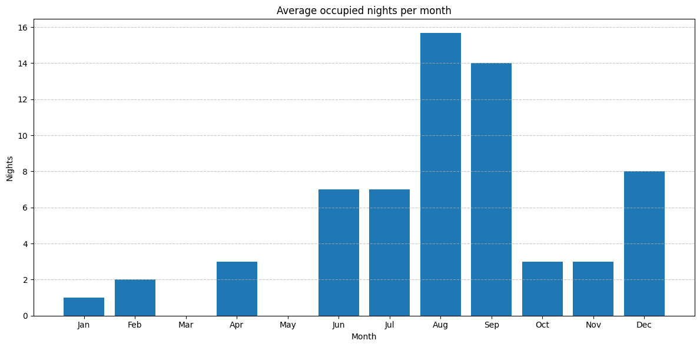
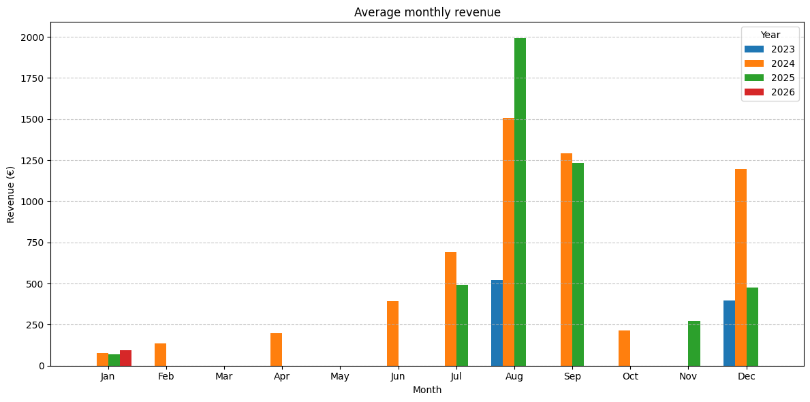
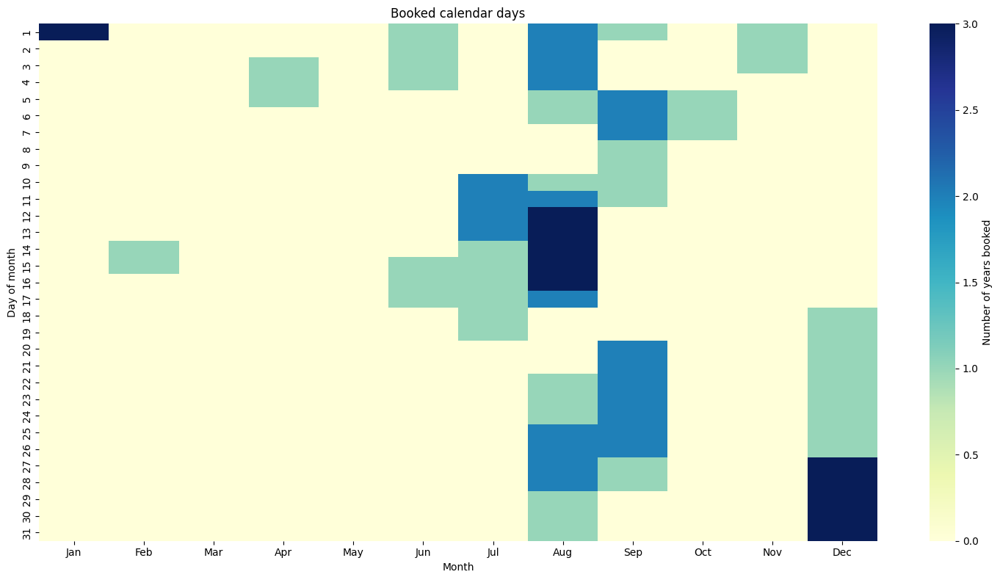
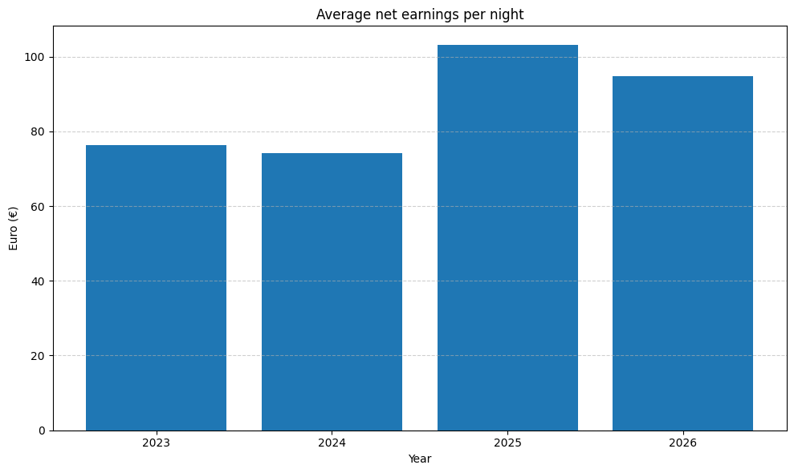
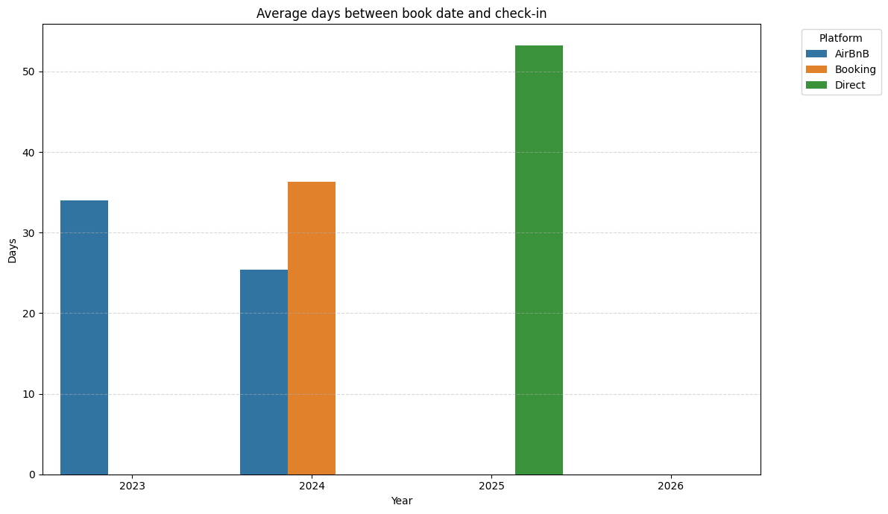

# BnB Reservation Analysis

This repository provides tools for analyzing short-term rental bookings across different platforms (e.g., Booking.com, Airbnb, direct bookings). It allows hosts to explore occupancy trends, revenue, and platform usage through interactive dashboards and visualizations.

## Features

- **Data Preprocessing**: Clean and standardize CSV booking files from multiple platforms.
- **Daily and monthly Summaries**: Expand bookings to daily records, compute nightly revenue, and summarize occupancy per month.
- **Visualizations**:
  - Monthly metrics per month (occupancy, revenue, etc.)
  - Calendar heatmaps showing booked days and nightly revenue
  - Platform usage analysis

### Examples











## Getting started
```bash
git clone https://github.com/matteociaroni/bnb-reservations-analysis
cd bnb-reservations-analysis
python -m venv .
source bin/activate
pip install numpy
pip install pandas
```
### Prepare the data
1. Place your platform CSVs in the `input/` directory. Example files are provided for reference.
2. Change fees and taxation in `src/prepare_data.py`. Default is italian.
3. Then execute `src/prepare_data.py`. This script reads the original CSVs from the `input` folder, processes them, and creates cleaned and merged CSVs in `output/` for analysis.
```bash
cd src
python prepare_data.py
```
### Jupyter Notebooks
Run the Jupyter notebooks in `notebooks/`.